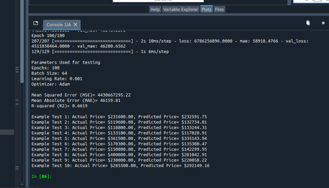

# California Housing Price Prediction

This project aims to predict housing prices in California using a neural network model. The dataset used for this project is the California Housing dataset, which contains information about various features of houses and their corresponding median house values.

## Project Structure

- `california_housing.py`: The main script that preprocesses the data, builds the neural network model, trains it, and evaluates its performance.
- `housing.csv`: The dataset containing information about houses in California.
- `images/comparison.png`: A plot showing the Mean Squared Error (MSE) and Mean Absolute Error (MAE) vs. Epochs.
- `actual_vs_predicttion.png`: A scatter plot comparing the actual house prices with the predicted house prices.
  Here is a comparison image showing the results:


## Requirements

- Python 3.x
- pandas
- scikit-learn
- tensorflow
- matplotlib

You can install the required packages using the following command:

```bash
pip install pandas scikit-learn tensorflow matplotlib
```

## Final Images

- MSE vs Epoch and MAE vs Epoch


- Predicted Price vs Actual Price


